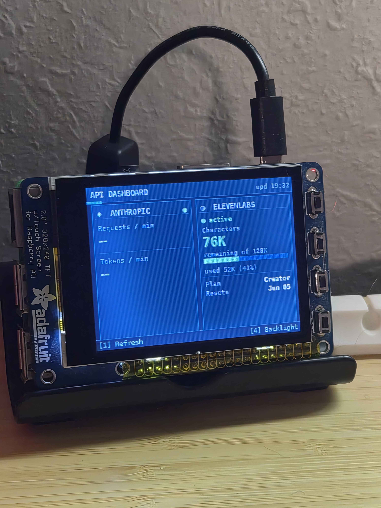

# PiTFT API Credit Dashboard

A Raspberry Pi dashboard showing live **Anthropic API** and **ElevenLabs**
account status on an Adafruit 2.8" PiTFT (320×240) hat.




---

## What's displayed

### Anthropic
- Live key status (green/red dot)
- Requests remaining vs limit (per minute) + progress bar
- Tokens remaining vs limit (per minute) + progress bar

### ElevenLabs
- Account status (active/inactive)
- Characters remaining + progress bar
- Plan tier and next reset date
- Overage if applicable

All data refreshes automatically every 5 minutes. Press **Button 1** to refresh immediately.

---

## Hardware

- Raspberry Pi 3 B+ (or any Pi with 40-pin GPIO and built-in WiFi)
- [Adafruit PiTFT 2.8" 320×240 + Resistive Touchscreen Hat](https://www.adafruit.com/product/2298)

**Button mapping (left → right on the hat):**

| Button | GPIO (BCM) | Function |
|--------|-----------|----------|
| 1 | 17 | Refresh now |
| 2 | 22 | Reserved |
| 3 | 23 | Reserved |
| 4 | 27 | Toggle backlight |

---

## How it works

Renders directly to `/dev/fb0` using Pillow — no SDL, no X11, no display
manager required. Works from a bare console with auto-login on tty1.

---

## Setup

### 1. Install PiTFT drivers

```bash
git clone https://github.com/adafruit/Raspberry-Pi-Installer-Scripts.git
cd Raspberry-Pi-Installer-Scripts
sudo pip3 install adafruit-python-shell --break-system-packages
sudo python3 adafruit-pitft.py
```

Choose **PiTFT 2.4", 2.8" or 3.2" resistive**, **90 degrees (landscape)**, **Display console on PiTFT**. Reboot when prompted.

### 2. Disable desktop (if running)

```bash
sudo systemctl disable display-manager
sudo reboot
```

### 3. Set up auto-login

```bash
sudo mkdir -p /etc/systemd/system/getty@tty1.service.d
sudo nano /etc/systemd/system/getty@tty1.service.d/autologin.conf
```

Paste:
```
[Service]
ExecStart=
ExecStart=-/sbin/agetty --autologin YOUR_USERNAME --noclear %I $TERM
```

### 4. Clone the repo

```bash
git clone https://github.com/KalinJenkins/token-dashboard.git
cd token-dashboard
```

### 5. Configure .env

```bash
cp .env.example .env
nano .env
```

### 6. Create venv and install dependencies

```bash
python3 -m venv venv --system-site-packages
source venv/bin/activate
pip install -r requirements.txt
```

### 7. Auto-launch on login

```bash
nano ~/.bash_profile
```

Add:
```bash
if [ "$(tty)" = "/dev/tty1" ]; then
    export SDL_VIDEODRIVER=fbcon
    export SDL_FBDEV=/dev/fb0
    export SDL_MOUSEDRV=TSLIB
    export SDL_MOUSEDEV=/dev/input/touchscreen
    cd ~/token-dashboard
    source venv/bin/activate
    python dashboard.py
fi
```

Reboot — the dashboard launches automatically.

---

## WiFi setup

```bash
rfkill unblock wifi
sudo nmcli con add type wifi ssid "Your Network" -- wifi-sec.key-mgmt wpa-psk wifi-sec.psk "your_password"
sudo nmcli con up wifi
```

---

## API Keys

### Anthropic API Key
- **console.anthropic.com** → Settings → API Keys → Create key
- Any regular key works — the dashboard reads rate-limit headers from API responses

### ElevenLabs API Key
- **elevenlabs.io** → avatar → Settings → Developers → API Keys
- Create a restricted key with **User: Read** access only

---

## .env reference

```bash
# Required
ANTHROPIC_API_KEY=sk-ant-api03-…
ELEVENLABS_API_KEY=…

# Optional
REFRESH_INTERVAL_SECONDS=300    # default: 300 (5 minutes)
```

---

## Project structure

```
token-dashboard/
├── dashboard.py          # Main loop, GPIO, Pillow framebuffer renderer
├── fetchers.py           # API fetchers (Anthropic + ElevenLabs)
├── requirements.txt
├── .env.example          # Template — copy to .env, never commit .env
├── .gitignore
├── pitft-dashboard.service   # systemd unit (optional, not used)
├── device.jpg            # Photo of the running dashboard
└── README.md
```

---

## Troubleshooting

**Black screen after boot**
Confirm `/dev/fb0` exists: `ls /dev/fb*`. The PiTFT driver must be installed first.

**Dashboard doesn't launch on boot**
Check `~/.bash_profile` exists and the `tty1` block is correct.

**Anthropic shows `—` for rate limits**
The rate-limit headers only appear when the API responds successfully. Check `ANTHROPIC_API_KEY` in `.env`.

**ElevenLabs shows an error**
Check `ELEVENLABS_API_KEY` in `.env`. A 401 means the key is wrong or expired.

**WiFi not connecting after reboot**
Run `nmcli dev status` — if wlan0 shows unavailable, try `rfkill unblock wifi` then `sudo systemctl restart NetworkManager`.